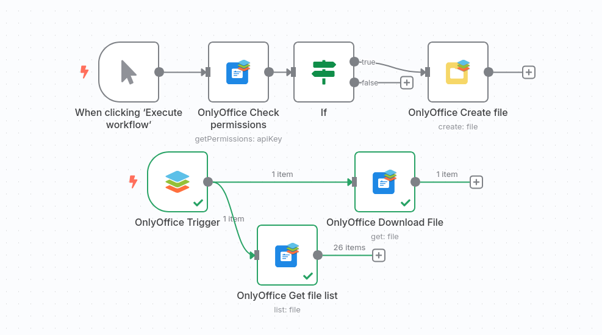

# OnlyOffice n8n Node

A comprehensive n8n node for integrating with OnlyOffice Document Server, providing Trigger events, file content fetching and file organization capabilities.



## Features

### OnlyOffice Trigger
Triggers workflows when files or folders are created, updated, renamed, moved, copied, or deleted in OnlyOffice

- Supports filtering by event types (File Created, File Updated, Folder Created, etc.)
- Automatically manages webhook registration with OnlyOffice API

### OnlyOffice Read
Retrieve and download files and folders from your OnlyOffice instance

- **List Files/Folders**: Browse contents of any folder (My Documents, Common Documents, or specific folder IDs)
- **Download Files**: Download files in their original format or convert to PDF
- **API Key Permissions**: Check your API token's permissions and access levels


### OnlyOffice Organize
- **List Files**: List all files/folders within your OnlyOffice instance
- **Create File**: Create new documents (Word, Excel, PowerPoint) and folders
- **Rename File**: Rename existing files/folders
- **Move/Copy File**: Move or copy files/folders to different locations
- **Delete File**: Delete files/folders (with option for immediate deletion or trash)

## Installation

### Self-Hosted n8n

1. Install the package in your n8n instance:
   ```bash
   npm install n8n-nodes-onlyoffice
   ```

2. Restart your n8n instance to load the new node.

### n8n Cloud

⚠️ **Important**: This community node is currently **not verified** for n8n Cloud. n8n Cloud only supports verified community nodes for security and stability reasons.

**Options for n8n Cloud users:**

1. **Request Verification**: Contact n8n support to request verification of this node for cloud use
2. **Self-Host**: Consider using a self-hosted n8n instance which supports all community nodes
3. **Alternative**: Use built-in HTTP Request nodes to interact with the OnlyOffice API directly

**Why the limitation?** n8n Cloud maintains a curated list of verified community nodes to ensure security, performance, and reliability for all cloud users. While this node works perfectly in self-hosted environments, it requires verification before being available in n8n Cloud.

## Configuration

### Credentials Setup

1. In n8n, go to **Credentials** and create a new **OnlyOffice API** credential
2. Configure the following:
   - **Base URL**: Your OnlyOffice instance URL (e.g., `https://your-onlyoffice-instance.com`)
   - **Access Token**: Your OnlyOffice API token

### Getting Your API Token

1. Log into your OnlyOffice instance
2. Go to **Settings** → **Integration** → **API**
3. Generate a new API token
4. Copy the token to use in n8n credentials

## Usage Examples

### List Files in My Documents
1. Add the **OnlyOffice Read** node to your workflow
2. Set **Resource** to "File" or "Folder"
3. Set **Operation** to "List"
4. Set **Folder ID** to `@my` (for My Documents) or `@common` (for Common Documents)

### Get File Contents
1. Add the **OnlyOffice Read** node to your workflow
2. Set **Resource** to "File"
3. Set **Operation** to "Get"
4. Set **Item ID** to the ID of the file you want to download (obtained from a List operation)
5. Choose **Output Format**:
   - **Original Format**: Download the file in its original format (.docx, .xlsx, .pptx, etc.)
   - **PDF**: Convert and download as PDF
6. Set **Binary Property** name (default: `data`) - this is where the file data will be stored
7. The file will be available as binary data in subsequent nodes

### Create a New Document
1. Add the **OnlyOffice Organize** node to your workflow
2. Set **Resource** to "File"
3. Set **Operation** to "Create"
4. Set **Parent Folder ID** to `@my`
5. Set **Title** to your desired filename (without extension)
6. Choose **File Type** (Document, Spreadsheet, or Presentation)

### Move a File
1. Add the **OnlyOffice Organize** node to your workflow
2. Set **Resource** to "File"
3. Set **Operation** to "Move"
4. Set **Item ID** to the ID of the file to move
5. Set **Destination Folder ID** to the target folder ID
6. Choose **Conflict Resolution** strategy

### Using the Webhook Trigger
1. Add the **OnlyOffice Trigger** node to your workflow
2. Select the **Events** you want to listen for (e.g., File Created, File Updated)
3. Activate the workflow - the webhook will be automatically registered with OnlyOffice
4. The workflow will trigger whenever the selected events occur in your OnlyOffice instance
5. Access webhook data in subsequent nodes using `$json.event.trigger` and `$json.payload.title`

## Folder IDs

- `@my` - My Documents folder
- `@common` - Common Documents folder
- `@shared` - Shared Documents folder
- `@trash` - Trash folder
- Or use specific folder IDs obtained from list operations

## File Types

When creating files, you can choose from:
- **Document (.docx)**: Microsoft Word compatible documents
- **Spreadsheet (.xlsx)**: Microsoft Excel compatible spreadsheets
- **Presentation (.pptx)**: Microsoft PowerPoint compatible presentations

## Conflict Resolution

When moving or copying files/folders, you can choose how to handle conflicts:
- **Skip**: Skip the operation if a file/folder with the same name exists
- **Overwrite**: Replace the existing file/folder
- **Duplicate**: Create a copy with a different name

## API Endpoints Used

This node uses the OnlyOffice Document Server API v2.0:
- `GET /api/2.0/files/{folderId}` - List folder contents
- `GET /api/2.0/files/file/{fileId}` - Get file metadata
- `GET /api/2.0/files/file/{fileId}/presigned` - Get presigned URL for file download
- `POST /api/2.0/files/folder/{parentFolderId}` - Create folder
- `POST /api/2.0/files/{parentFolderId}/file` - Create file
- `PUT /api/2.0/files/folder/{itemId}` - Rename folder
- `PUT /api/2.0/files/file/{itemId}` - Rename file
- `PUT /api/2.0/files/fileops/move` - Move items
- `PUT /api/2.0/files/fileops/copy` - Copy items
- `DELETE /api/2.0/files/folder/{itemId}` - Delete folder
- `DELETE /api/2.0/files/file/{itemId}` - Delete file
- `GET /api/2.0/keys/permissions` - Get API key permissions
- `GET /api/2.0/settings/webhook` - List webhooks
- `POST /api/2.0/settings/webhook` - Create webhook
- `DELETE /api/2.0/settings/webhook/{webhookId}` - Delete webhook

## Webhook Payload Structure

The OnlyOffice Trigger node receives webhook payloads with the following structure:

```typescript
{
  event: {
    id: number;
    createOn: string;
    createBy: string;
    trigger: string;        // e.g., "file.updated", "file.created"
    triggerId: number;
  },
  payload: {
    id: number;
    parentId: number;
    folderIdDisplay: number;
    rootId: number;
    title: string;          // File or folder name
    createBy: string;
    modifiedBy: string;
    createOn: string;
    modifiedOn: string;
    rootFolderType: number;
    rootCreateBy: string;
    fileEntryType: number;
  },
  webhook: {
    id: number;
    name: string;
    url: string;
    triggers: string[];
  }
}
```

Type definitions and validation utilities are available in `nodes/OnlyOffice/OnlyOfficeWebhook.types.ts`.

## Development

### Local Development Setup

1. **Build the node**:
   ```bash
   npm install
   npm run build
   ```

2. **Install to n8n's custom nodes directory** (default: `~/.n8n/nodes` or `$N8N_USER_FOLDER/nodes`):
   ```bash
   cd ~/.n8n/nodes
   npm install /path/to/OnlyOffice-n8n
   ```

3. **Restart n8n**

After making changes, rebuild and reinstall:
```bash
npm run build
cd ~/.n8n/nodes && npm install /path/to/OnlyOffice-n8n
```

### Development Mode

Watch for TypeScript changes:

```bash
npm run dev
```

### Linting

```bash
npm run lint
npm run lintfix
```

### Project Structure

```
nodes/OnlyOffice/
├── OnlyOfficeRead.node.ts          # Read operations (list, get, permissions)
├── onlyOfficeOrganize.node.ts      # Write operations (create, rename, move, copy, delete)
├── OnlyOfficeTrigger.node.ts       # Webhook trigger node
├── OnlyOfficePermissions.helper.ts # Permission checking utilities
├── OnlyOfficeWebhook.types.ts      # TypeScript types and validation utilities
└── onlyoffice.svg                  # Node icon
```

The `OnlyOfficeWebhook.types.ts` file contains:
- TypeScript interfaces for webhook payloads
- Type guard functions for runtime validation
- Helper functions for safely extracting webhook data

## License

MIT

## Support

For issues and feature requests, please create an issue in the GitHub repository.
